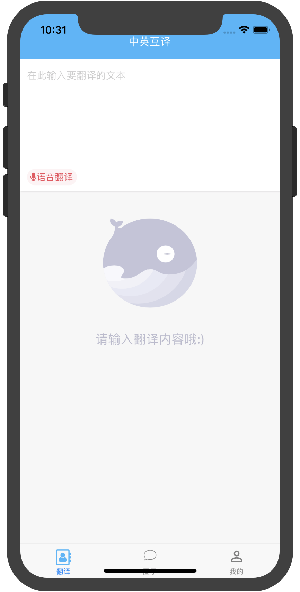
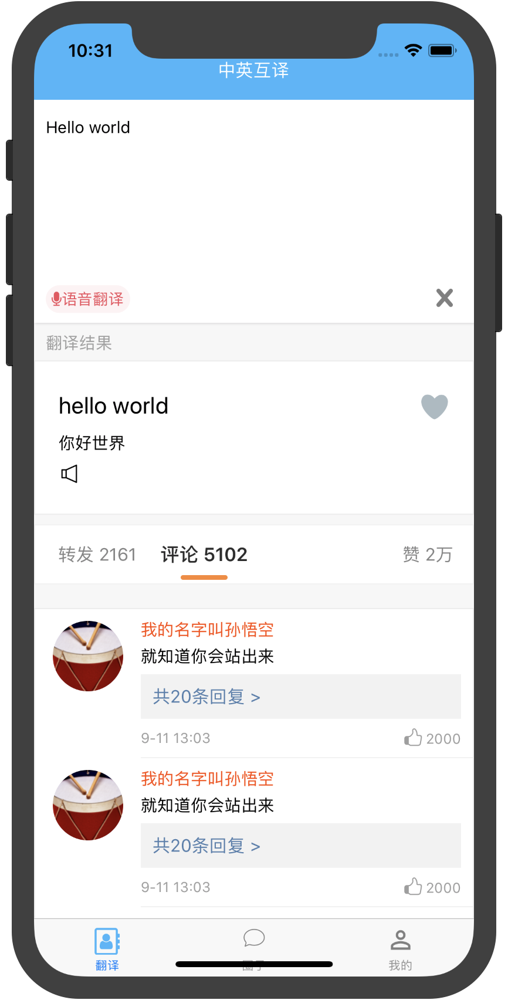
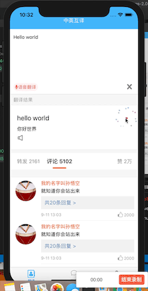
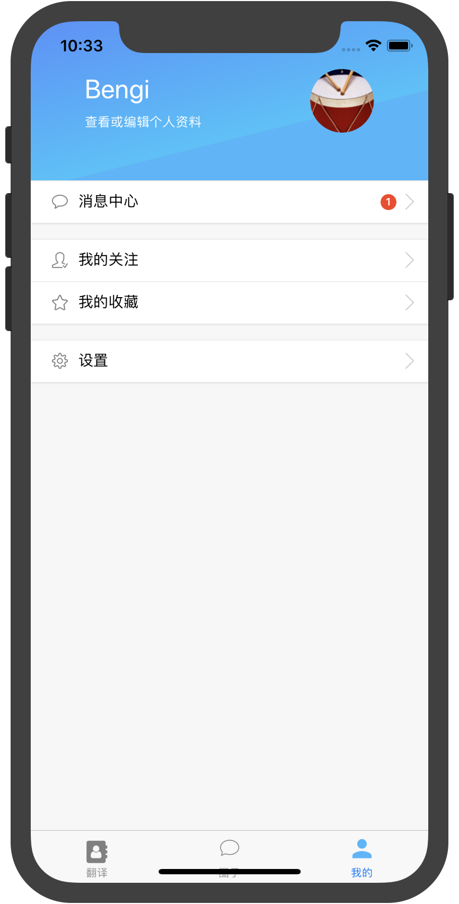
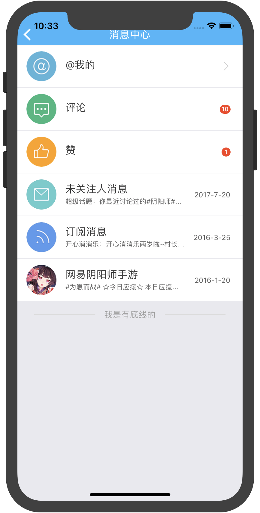
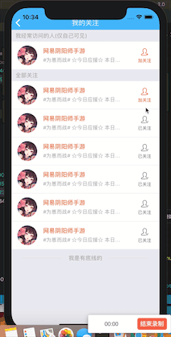
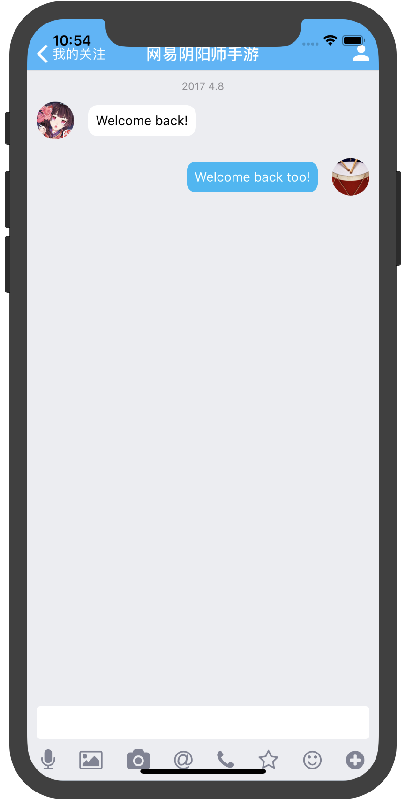
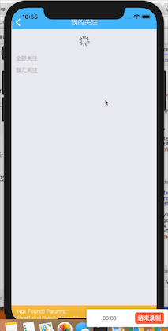
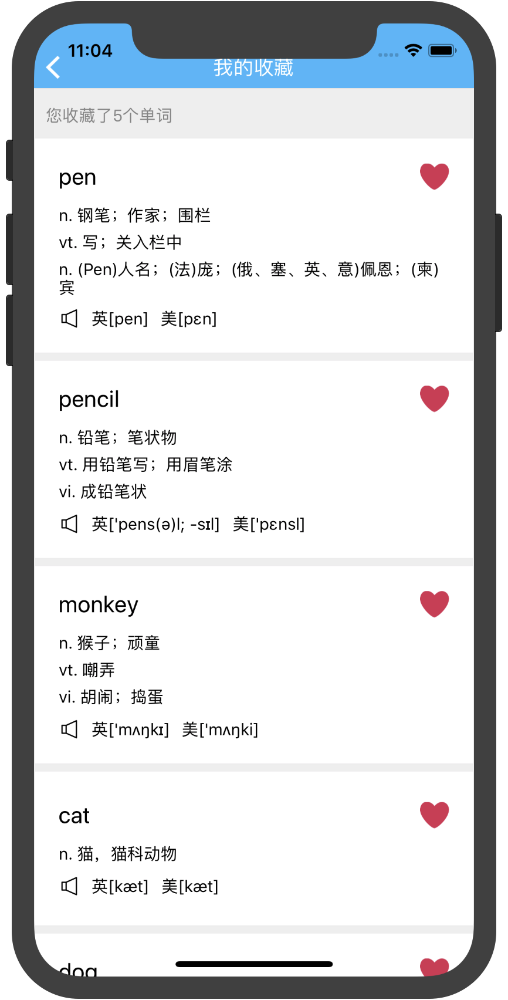

### SNS

### 截图











### 目录结构
```bash
.
├── components
│   ├── AudioBtnGroup
│   │   └── index.js
│   ├── AudioComponent
│   │   └── index.js
│   ├── Badge
│   │   └── index.js
│   ├── Collection
│   │   └── index.js
│   ├── ImageWithTitle
│   │   └── index.js
│   ├── ImgBackground
│   │   └── index.js
│   ├── ImgBtn
│   │   └── index.js
│   ├── InputArea
│   │   └── index.js
│   ├── LoginComponent
│   │   └── index.js
│   ├── LoginInput
│   │   └── index.js
│   ├── PersonPage_btn
│   │   └── index.js
│   ├── Separated
│   │   └── index.js
│   ├── SvgBackground
│   │   └── index.js
│   ├── TranslateHeader
│   │   └── index.js
│   ├── WordItem
│   │   └── index.js
│   ├── emptyStatus
│   │   └── index.js
│   ├── normalComponent
│   │   └── index.js
│   └── renderFooter
│       └── index.js
├── config
│   ├── app.js
│   ├── cacheImg.js
│   └── md5.js
├── containers
│   ├── Moments
│   │   ├── index.js
│   │   └── test.js
│   ├── Navigation
│   │   └── index.js
│   ├── PersonPage
│   │   ├── chat
│   │   │   └── index.js
│   │   ├── collection
│   │   │   └── index.js
│   │   ├── followingPage
│   │   │   └── index.js
│   │   ├── home
│   │   │   └── index.js
│   │   ├── loginPage
│   │   │   └── index.js
│   │   └── message
│   │       └── index.js
│   └── TranslationPage
│       ├── comment
│       │   └── index.js
│       ├── homepage
│       │   └── index.js
│       ├── subpage
│       │   └── index.js
│       └── voicePage
│           └── index.js
├── fetch
│   ├── Login
│   │   └── login.js
│   ├── Translate
│   │   └── translate.js
│   ├── config.json
│   ├── fetchUserInfo.js
│   ├── get.js
│   ├── post.js
│   └── request.js
├── mobx
│   ├── chat.js
│   └── store.js
├── router
│   └── routerMap.js
├── static
│   ├── lottie
│   │   ├── TwitterHeart.json
│   │   ├── download_icon_success.json
│   │   ├── empty_status.json
│   │   ├── favourite_app_icon.json
│   │   ├── like.json
│   │   ├── react_logo.json
│   │   └── voice.json
│   ├── sound
│   │   └── linjunj.mp3
│   └── style
│       └── common.js
└── storage
    ├── index.js
    └── load.js
```
